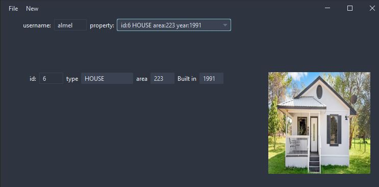

# ApartmentManagerSwingJPA
apartment manager with swing and JPA

### swing app 'Apartment Manager' , stores data in the database PostgreSQL .

*in alpha*

**prerequisites**

  - Postgresql database 'jdncdemodb'

```
create table users ( id bigint PRIMARY KEY, first_name varchar(20) NOT NULL, last_name varchar(20) NOT NULL, user_name varchar(20) NOT NULL UNIQUE );
create table property ( id bigint PRIMARY KEY, type varchar(20) NOT NULL, area smallint NOT NULL, build smallint NOT NULL, photo bytea );
ALTER TABLE property ADD COLUMN user_id bigint NOT NULL CONSTRAINT property_user_fk_user_id REFERENCES users (id) ON UPDATE CASCADE ON DELETE CASCADE;
create sequence property_id_seq;
create sequence users_id_seq;
```


